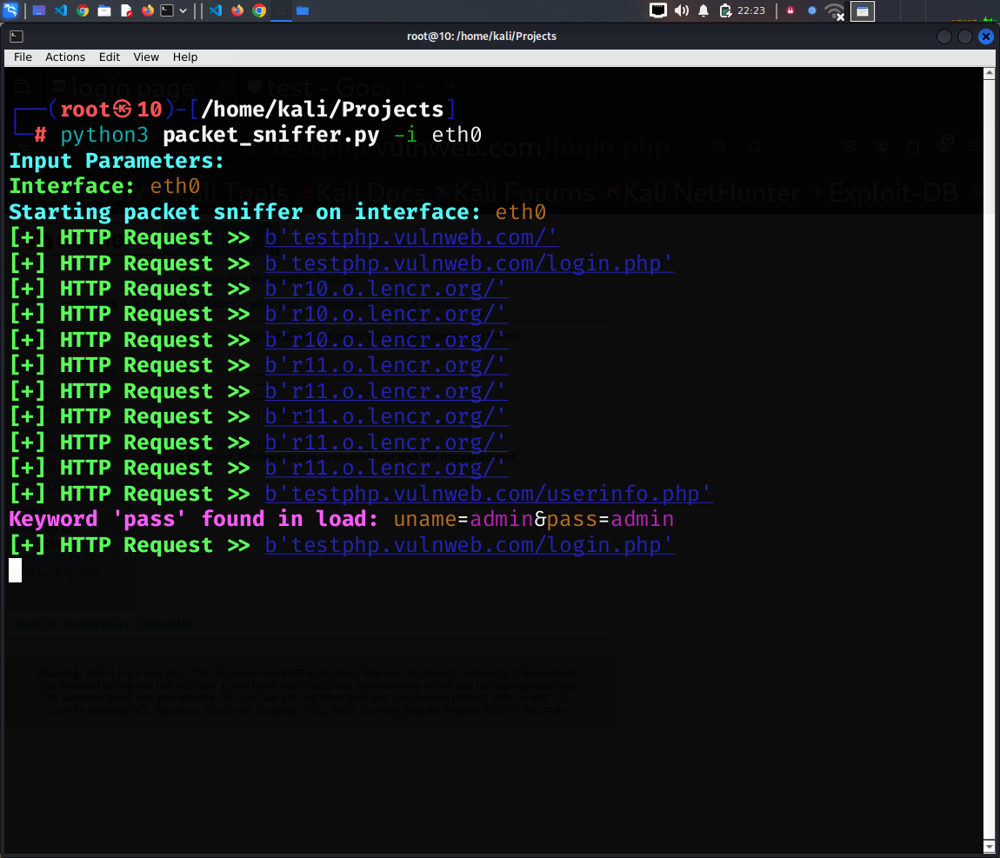

# Packet Sniffer Tool

<p align="center">
  <a href="#introduction">Introduction</a> •
  <a href="#features">Features</a> •
  <a href="#installation">Installation</a> •
  <a href="#usage">Usage</a> •
  <a href="#working">Working</a> •
  <a href="#future-enhancements">Future Enhancements</a> •
  <a href="#disclaimer">Disclaimer</a>
</p>

---

## Introduction

The **Packet Sniffer Tool** is a Python-based utility that uses the `Scapy` library to capture and analyze network packets in real-time. This tool helps in monitoring HTTP traffic, detecting sensitive keywords like `username` and `password`, and provides insights into network activity for educational or penetration testing purposes.


## Screenshots

<h1 align="left">
  </a>
  <br>
</h1>

---

## Features

- **Real-Time Packet Capture**: Captures and analyzes packets from a specified network interface.
- **HTTP Request Monitoring**: Extracts URLs from HTTP requests and displays them in a readable format.
- **Keyword Detection**: Highlights sensitive data like `username`, `password`, and `email` in intercepted packets.
- **Rich Integration**: Beautifies the output using the `Rich` library for better readability.
- **Command-Line Interface**: Easily configurable through command-line arguments.

---

## Installation

### Prerequisites

To run this project, you need:

- **Python**: Version 3.6 or higher.
- **Scapy Library**: Install it using pip:
  ```bash
  pip install scapy
  pip install rich

  git clone https://github.com/your-repo/packet-sniffer.git
  cd packet-sniffer


---

## Usage
- 1. Run the script with the required arguments:
